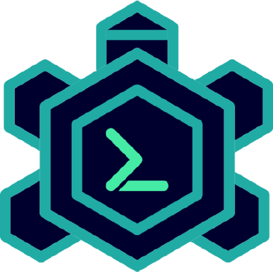
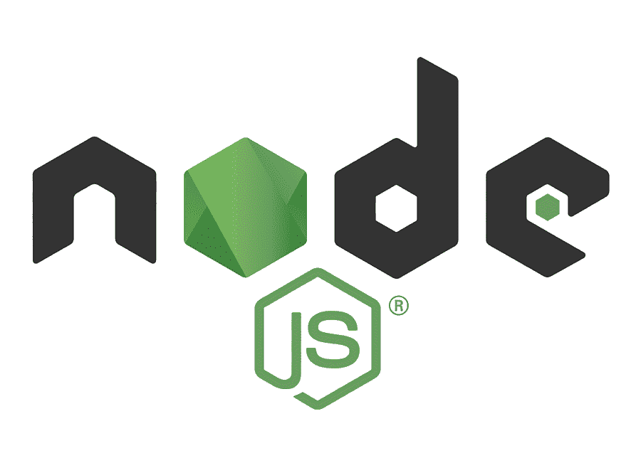
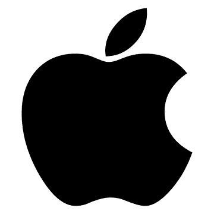

# &nbsp;&nbsp;Votsup - Clone of Whatsup

## Technology Stack
### Programming Language
> TypeScript&nbsp;&nbsp;&nbsp;&nbsp;

### Front End

 React Native

####Main Libraries

> EXPO&nbsp;&nbsp;&nbsp;&nbsp; React Navigation&nbsp;&nbsp;&nbsp;&nbsp; Async Storage

#### Build
> Turtle-CLI

---

### Back End

 Node.js

#### Main Libraries
> Express&nbsp;&nbsp;&nbsp;&nbsp; Mongoose&nbsp;&nbsp;&nbsp;&nbsp;

---

### Cloud Services
 Mongodb&nbsp;&nbsp;&nbsp;&nbsp; Pusher

---

## Projects

> [Votsup - Mobile](./Votsup)
>
>
>### 20 Feb, 2021 ~ Current

---

>[Votsup - Server](./Votsup)
>
>### 5 Mar, 2021 ~ Current

